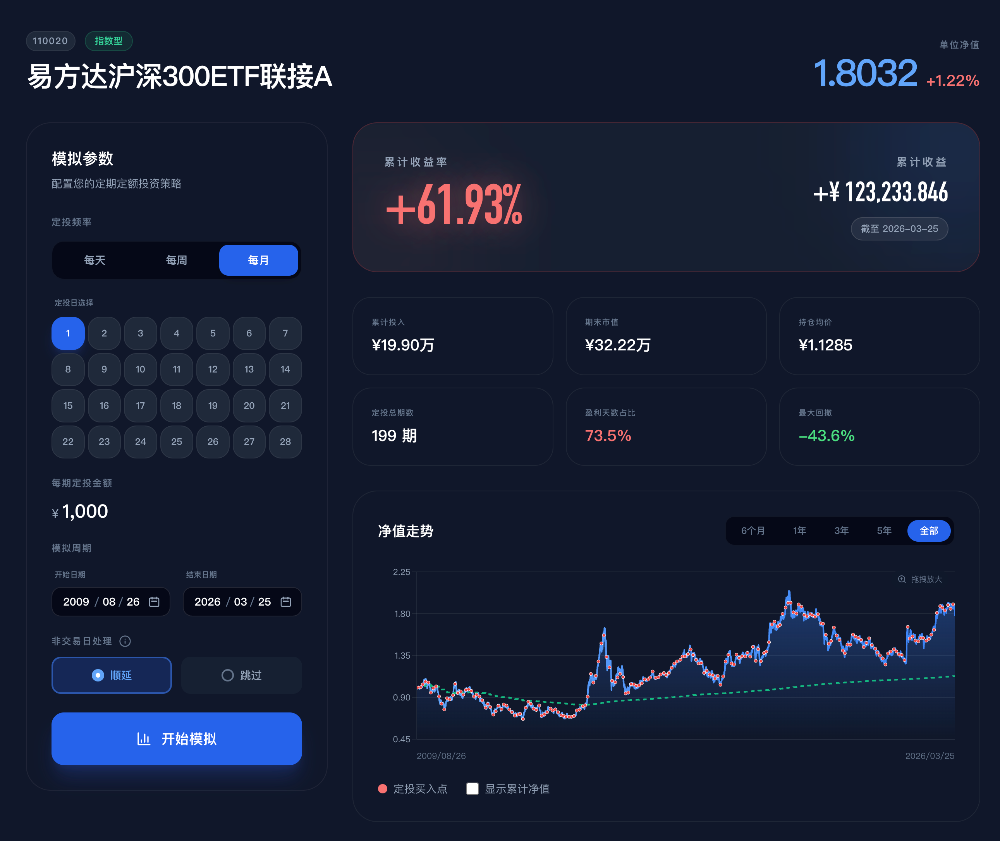
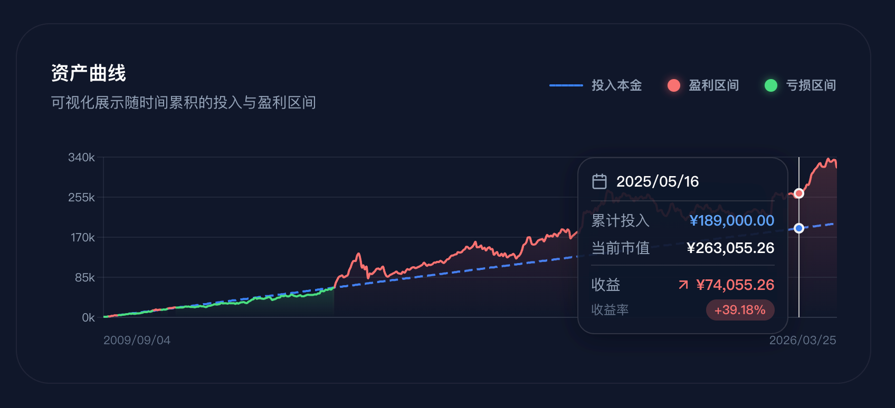
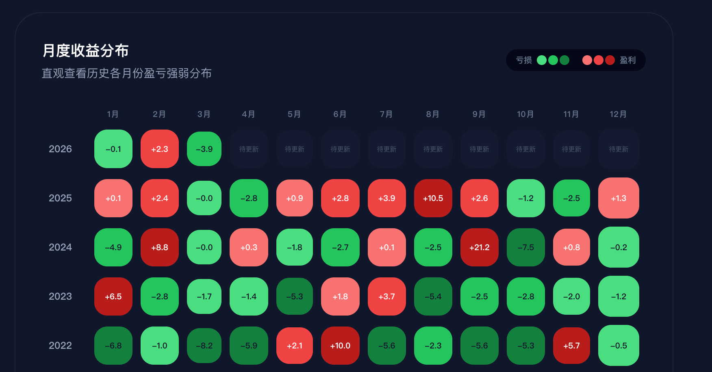

# 基金定投模拟器

> **Vibe Coding** 作品 —— 从构思到实现，全部代码由 AI 生成，人类只负责描述需求和验收。

输入基金代码，配置定投策略，即可查看历史模拟结果。

👉 **在线体验**：[dca-simulator-seven.vercel.app](https://dca-simulator-seven.vercel.app)

## 功能

- **基金搜索**：输入代码（如 110020），自动获取历史净值数据
- **策略配置**：支持每月/每周/每日定投，自定义金额和日期
- **收益分析**：累计投入、期末市值、收益率、最大回撤、盈利天数占比
- **可视化**：净值走势图、资产曲线、月度收益热力图

无需注册，打开即用。

## 预览

### 净值走势与投资点

### 收益概览

### 月度收益热力图

## Roadmap

| 功能 | 状态 |
|------|:----:|
| 基金搜索与净值历史 | ✅ |
| 定投策略配置（月/周/日） | ✅ |
| 收益分析（收益率、最大回撤等） | ✅ |
| 可视化图表（净值走势、资产曲线、热力图） | ✅ |
| 扩展定投策略参数（智能定投、估值定投） | 📋 |
| 多基金对比模式 | 📋 |
| 基准对比（沪深300、中证500） | 📋 |

## 技术栈

- **前端**：Next.js 14 + React 18
- **图表**：Recharts
- **样式**：Tailwind CSS
- **数据**：天天基金 API

## 免责声明

> ⚠️ **历史业绩不代表未来表现。本工具仅供学习参考，不构成任何投资建议。投资有风险，入市需谨慎。**
